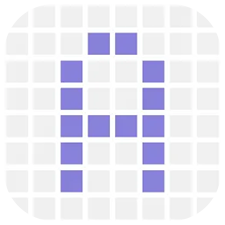

# ioBroker.awtrix-ng

## Versions

Integrate your [Awtrix NG](https://github.com/Blueforcer/awtrix-ng) device (e.g. Ulanzi TC001) via HTTP

Buy here: [Aliexpress.com](https://haus-auto.com/p/ali/UlanziTC001), here: [Amazon.de](https://haus-auto.com/p/amz/UlanziTC001) or here: [ulanzi.de](https://haus-auto.com/p/ula/UlanziTC001) (Affiliate-Links)

## Sponsored by

## Documentation

[🇺🇸 Documentation](./docs/en/README.md)

[🇩🇪 Dokumentation](./docs/de/README.md)

## Changelog
<!--
    Placeholder for the next version (at the beginning of the line):
    ### **WORK IN PROGRESS**
-->
### **WORK IN PROGRESS**

* (@klein0r) Removed device update state and notification
* (@klein0r) Fixed rtttl endpoint
* (@klein0r) Improved error handling

### 0.0.6 (2026-08-04)

* (@klein0r) Renamed visible to enabled
* (@klein0r) Added slot positions

### 0.0.4 (2026-07-30)

* (@klein0r) Added weather overlays to expert apps
* (@klein0r) Fixed state object role definitions

### 0.0.3 (2026-07-29)

* (@klein0r) Updated settings workflow and keys for Awtrix NG

### 0.0.2 (2026-07-29)

* (@klein0r) Updated API and settings for new Awtrix NG firmware

[Older changelogs can be found there](CHANGELOG_OLD.md)

## License

MIT License

Copyright (c) 2026 Matthias Kleine <info@haus-automatisierung.com>

Permission is hereby granted, free of charge, to any person obtaining a copy
of this software and associated documentation files (the "Software"), to deal
in the Software without restriction, including without limitation the rights
to use, copy, modify, merge, publish, distribute, sublicense, and/or sell
copies of the Software, and to permit persons to whom the Software is
furnished to do so, subject to the following conditions:

The above copyright notice and this permission notice shall be included in all
copies or substantial portions of the Software.

THE SOFTWARE IS PROVIDED "AS IS", WITHOUT WARRANTY OF ANY KIND, EXPRESS OR
IMPLIED, INCLUDING BUT NOT LIMITED TO THE WARRANTIES OF MERCHANTABILITY,
FITNESS FOR A PARTICULAR PURPOSE AND NONINFRINGEMENT. IN NO EVENT SHALL THE
AUTHORS OR COPYRIGHT HOLDERS BE LIABLE FOR ANY CLAIM, DAMAGES OR OTHER
LIABILITY, WHETHER IN AN ACTION OF CONTRACT, TORT OR OTHERWISE, ARISING FROM,
OUT OF OR IN CONNECTION WITH THE SOFTWARE OR THE USE OR OTHER DEALINGS IN THE
SOFTWARE.
