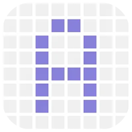

# ioBroker.awtrix-ng

## Versions

Integrate your [Awtrix NG](https://github.com/Blueforcer/awtrix-ng) device (e.g. Ulanzi TC001) via HTTP

Buy TC001 here: [Aliexpress.com](https://haus-auto.com/p/ali/UlanziTC001), here: [Amazon.de](https://haus-auto.com/p/amz/UlanziTC001) or here: [ulanzi.de](https://haus-auto.com/p/ula/UlanziTC001) (Affiliate-Links)

Buy TC002 here: [Amazon.de](https://haus-auto.com/p/amz/UlanziTC002) or here: [ulanzi.de](https://haus-auto.com/p/ula/UlanziTC002) (Affiliate-Links)

## Sponsored by

## Documentation

[🇺🇸 Documentation](./docs/en/README.md)

[🇩🇪 Dokumentation](./docs/de/README.md)

## Changelog
<!--
    Placeholder for the next version (at the beginning of the line):
    ### **WORK IN PROGRESS**
-->
### **WORK IN PROGRESS**

* (@klein0r) Recommended Awtrix NG version is now 1.1.4

### 0.3.0 (2026-09-30)

* (@klein0r) Added playback of MP3 files (`audio.mp3.*`) for devices which support it (e.g. TC002)
* (@klein0r) Added playback of melodies (`audio.melody.*`)
* (@klein0r) Screen content (`display.content`) is a much smaller SVG now (about 95 % less data) and just written when it has changed

### 0.2.0 (2026-09-30)

* (@klein0r) Port of the device is configurable now (default: 80)
* (@klein0r) Apps are transferred again when a reboot of the device has been detected
* (@klein0r) App order (enabled / slot) is transferred to the device on connect
* (@klein0r) Custom apps are transferred even if disabled (visibility is controlled by the device)
* (@klein0r) Fixed custom apps with invalid object ID being transferred as background-only apps
* (@klein0r) History apps keep refreshing after errors and retry if the history instance was unavailable
* (@klein0r) Custom and expert apps get a lifetime if "Delete apps when instance is stopped" is enabled (removed from device if the adapter is not running anymore)
* (@klein0r) App names may contain digits, `_` and `-` now
* (@klein0r) Added states `apps.<name>.present` and `apps.<name>.lastError`
* (@klein0r) Failed steps when transferring data to the device (settings, apps, indicators, ...) are retried with the next refresh
* (@klein0r) Apps which have been removed from the device (e.g. scripts) are cleaned up properly
* (@klein0r) Apps are removed in parallel when the instance is stopped (and not at all if the device is not reachable)
* (@klein0r) Changing `apps.<name>.slot` moves the app to the new position (other apps are shifted) - order and enabled state are managed by ioBroker
* (@klein0r) Added internet radio (`audio.radio.*`) for devices which support it (e.g. TC002)
* (@klein0r) Fixed display duration of custom and history apps (setting was ignored)
* (@klein0r) Scroll speed of custom apps is a percentage of the default speed now (up to 500 %) and does not force scrolling of short texts anymore
* (@klein0r) Improved instance configuration (dependencies between fields, validation, labels and help texts)
* (@klein0r) Migrated all HTTP requests to the new library [awtrix-ng-api](https://www.npmjs.com/package/awtrix-ng-api)
* (@klein0r) Fixed screen content download (`display.content`)
* (@klein0r) Added additional meta information (soc and board type)
* (@klein0r) Recommended Awtrix NG version is now 1.1.2
* (ioBroker-Bot) Adapter requires admin >= 7.8.23 now.

### 0.1.0 (2026-08-11)

* (@klein0r) Used new audio API endpoint for all types of sounds (file, mp3, rtttl)
* (@klein0r) Recommended Awtrix NG version is now 1.1.0

### 0.0.10 (2026-08-07)

* (@klein0r) Updated documentation
* (@klein0r) Recommended Awtrix NG version is now 1.0.15
* (@klein0r) Automatically cast icon value to string in notifications

### 0.0.9 (2026-08-06)

* (@klein0r) Removed option to automatically delete other apps
* (@klein0r) Updated logo

[Older changelogs can be found there](CHANGELOG_OLD.md)

## License

MIT License

Copyright (c) 2026 Matthias Kleine <info@haus-automatisierung.com>

Permission is hereby granted, free of charge, to any person obtaining a copy
of this software and associated documentation files (the "Software"), to deal
in the Software without restriction, including without limitation the rights
to use, copy, modify, merge, publish, distribute, sublicense, and/or sell
copies of the Software, and to permit persons to whom the Software is
furnished to do so, subject to the following conditions:

The above copyright notice and this permission notice shall be included in all
copies or substantial portions of the Software.

THE SOFTWARE IS PROVIDED "AS IS", WITHOUT WARRANTY OF ANY KIND, EXPRESS OR
IMPLIED, INCLUDING BUT NOT LIMITED TO THE WARRANTIES OF MERCHANTABILITY,
FITNESS FOR A PARTICULAR PURPOSE AND NONINFRINGEMENT. IN NO EVENT SHALL THE
AUTHORS OR COPYRIGHT HOLDERS BE LIABLE FOR ANY CLAIM, DAMAGES OR OTHER
LIABILITY, WHETHER IN AN ACTION OF CONTRACT, TORT OR OTHERWISE, ARISING FROM,
OUT OF OR IN CONNECTION WITH THE SOFTWARE OR THE USE OR OTHER DEALINGS IN THE
SOFTWARE.
